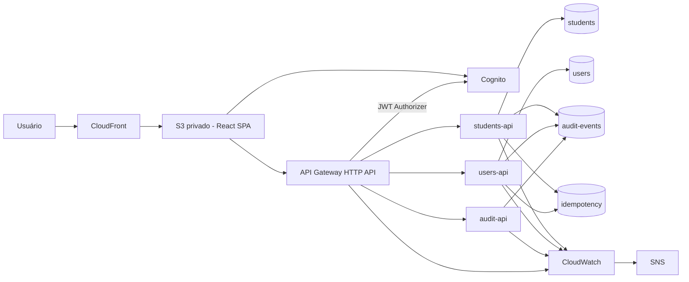
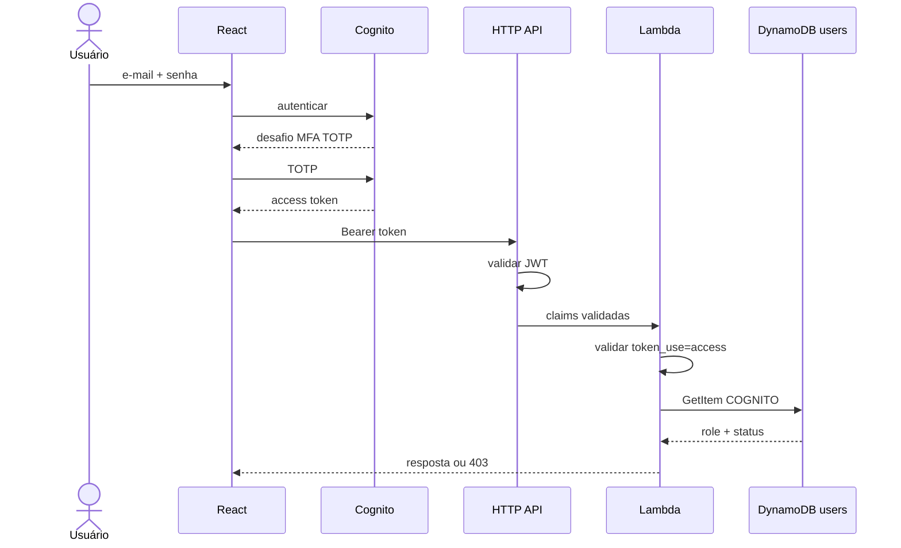
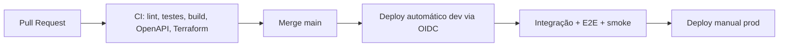
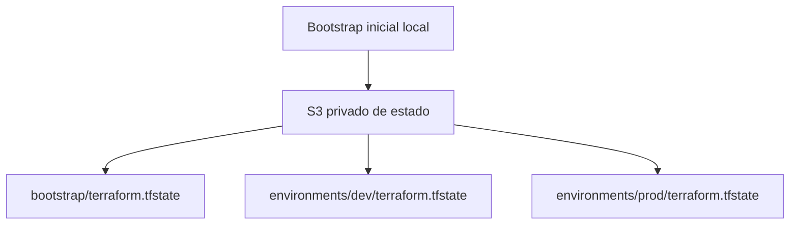

# Diagramas

## 1. Arquitetura de alto nível

```mermaid
flowchart LR
    U[Usuário] --> CF[CloudFront]
    CF --> S3[S3 privado - React SPA]
    S3 --> COG[Cognito]
    S3 --> API[API Gateway HTTP API]
    API -->|JWT Authorizer| COG

    API --> STU[students-api]
    API --> USR[users-api]
    API --> AUD[audit-api]

    STU --> DST[(students)]
    USR --> DUS[(users)]
    STU --> DAU[(audit-events)]
    USR --> DAU
    AUD --> DAU

    STU --> DID[(idempotency)]
    USR --> DID

    STU --> CW[CloudWatch]
    USR --> CW
    AUD --> CW
    API --> CW
    CW --> SNS[SNS]
```

## 2. Autorização

```mermaid
sequenceDiagram
    actor User as Usuário
    participant Web as React
    participant Cognito
    participant API as HTTP API
    participant Lambda
    participant Users as DynamoDB users

    User->>Web: e-mail + senha
    Web->>Cognito: autenticar
    Cognito-->>Web: desafio MFA TOTP
    Web->>Cognito: TOTP
    Cognito-->>Web: access token
    Web->>API: Bearer token
    API->>API: validar JWT
    API->>Lambda: claims validadas
    Lambda->>Lambda: validar token_use=access
    Lambda->>Users: GetItem COGNITO#sub (consistent)
    Users-->>Lambda: role + status
    Lambda-->>Web: resposta ou 403
```

## 3. Entrega

```mermaid
flowchart LR
    PR[Pull Request] --> CI[CI: lint, testes, build, OpenAPI, Terraform]
    CI --> MAIN[Merge main]
    MAIN --> DEV[Deploy automático dev via OIDC]
    DEV --> TEST[Integração + E2E + smoke]
    TEST --> PROD[Deploy manual prod]
```

## 4. Terraform state

```mermaid
flowchart TD
    LOCAL[Bootstrap inicial local] --> S3STATE[S3 privado de estado]
    S3STATE --> BOOT[bootstrap/terraform.tfstate]
    S3STATE --> DEV[environments/dev/terraform.tfstate]
    S3STATE --> PROD[environments/prod/terraform.tfstate]
```
